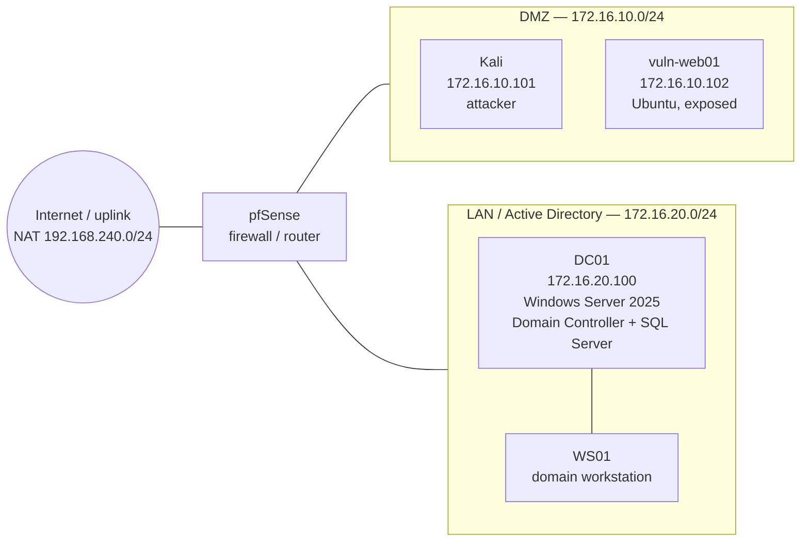
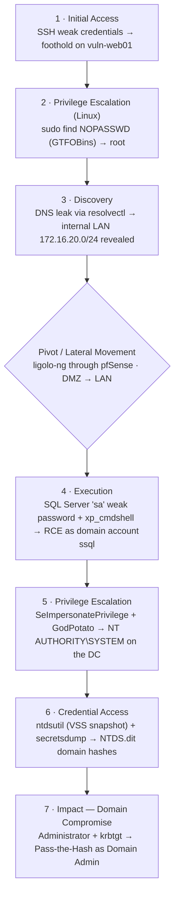
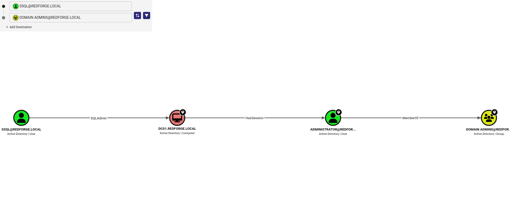

# RedForge

**A self-built, intentionally vulnerable Active Directory lab — and a full attack chain from a DMZ foothold to complete domain compromise.**

RedForge is a segmented Active Directory environment I designed, built, and attacked end-to-end in an isolated VMware lab. Starting from zero credentials with access only to the DMZ, the engagement reaches full control of the `redforge.local` domain through a chain of realistic, everyday misconfigurations.

> [!NOTE]
> **Scope & ethics.** RedForge is a personal, fully isolated lab (VMware Workstation, host-only networking). Every offensive action was performed exclusively against my own lab VMs. Nothing here targets real systems.

---

## Overview

The goal of the exercise: **starting from a foothold in the DMZ, with no pre-assigned domain credentials, determine whether and how an attacker can reach full compromise of the internal domain.**

A binding rule shaped the whole engagement — *zero-to-credential*: no IP, username, port, or credential was assumed as known. Everything was discovered during the attack through enumeration, cracking, or abuse of misconfigurations.

The outcome was a **complete domain compromise**: NTLM hashes for every account in the domain were extracted, including the Administrator and the `krbtgt` account (enabling Golden Ticket forgery). The single most important root cause is architectural — **an application (SQL Server) installed directly on the Domain Controller** — which collapsed "compromise the app" into "own the domain."

---

## Network architecture

Three segments separated by pfSense. The attacker VM only ever touches the DMZ; the internal LAN is reachable only by pivoting through a compromised DMZ host.



| Host | Segment | Address | Role |
|------|---------|---------|------|
| Kali | DMZ | 172.16.10.101 | Attacker workstation |
| vuln-web01 | DMZ | 172.16.10.102 | Exposed target (Ubuntu) |
| DC01 | LAN | 172.16.20.100 | Domain Controller, Windows Server 2025 |
| WS01 | LAN | — | Domain-joined workstation |

**Segmentation observed:** DMZ→LAN traffic is allowed in a controlled way (used for the pivot); **LAN→DMZ is blocked** (the DC cannot initiate connections back to the DMZ). vuln-web01 is single-homed on the DMZ — the internal network is discovered through information disclosure, not a second NIC.

---

## Attack path

Each phase enables the next. The pivot through pfSense is the only bridge into the internal network. Tactic labels map to MITRE ATT&CK.



The full walkthrough, with commands and rationale for each step, is in [`report/REPORT.md`](report/REPORT.md).

The privileged relationship confirmed in BloodHound — a SQL service account with a session path straight to Domain Admins:



---

## Key findings

| # | Finding | Severity |
|---|---------|----------|
| F1 | SQL Server installed on the Domain Controller | Critical |
| F2 | Weak `sa` login (Mixed Mode) exposed on the network | Critical |
| F3 | `xp_cmdshell` enabled + SQL service running as a domain account | High |
| F4 | `SeImpersonatePrivilege` on the service account | High |
| F5 | Weak service-account passwords with Kerberoastable SPNs | Medium |
| F6 | Weak credentials on an exposed SSH service (DMZ) | Medium |
| F7 | Internal DNS exposed to a DMZ host (information disclosure) | Medium |

Each finding is detailed in the report with impact, root cause, and remediation. The single highest-impact fix is **F1**: removing SQL Server from the Domain Controller breaks the documented path from application compromise to domain compromise.

---

## Repository structure

```
redforge/
├── README.md            # this file
├── report/
│   └── REPORT.md        # full technical report
├── scripts/             # custom tooling written for the lab
│   ├── port_scanner.py
│   ├── parse_kerb.py
│   └── report_generator.py
├── diagrams/            # network topology and attack path (Mermaid)
└── evidence/            # command output and screenshots
```

## Custom tooling

Written from scratch during the lab rather than relying only on off-the-shelf tools:

- **`port_scanner.py`** — threaded port scanner with host discovery, used for recon and target discovery through the pivot.
- **`parse_kerb.py`** — parses a raw Kerberos ticket into hashcat format for offline cracking.
- **`report_generator.py`** — helper to support documentation and reporting.

## Techniques exercised

Recon & enumeration · initial access · Linux privilege escalation (GTFOBins) · network pivoting (ligolo-ng) · MSSQL abuse (`xp_cmdshell`) · Windows privilege escalation (`SeImpersonatePrivilege` / Potato) · Active Directory enumeration (BloodHound) · credential access (NTDS.dit via `ntdsutil`) · Pass-the-Hash · defensive analysis and remediation.

## Stack

VMware Workstation · pfSense · Windows Server 2025 (Active Directory, DNS, SQL Server) · Windows 10/11 client · Ubuntu Server · Kali Linux.
