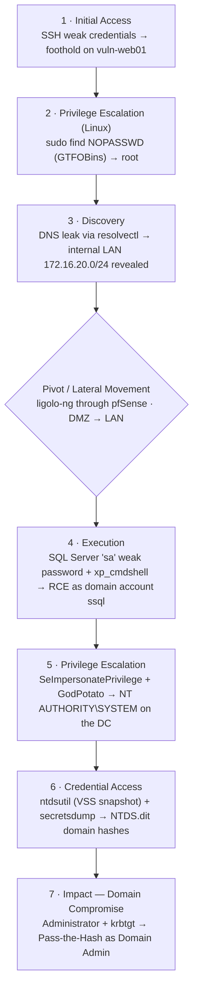

# Attack path

Full kill chain from a DMZ foothold to domain compromise. Each phase enables the next; the pivot through pfSense is the only bridge into the internal network. Tactic labels map to MITRE ATT&CK.



## BloodHound path

The privileged relationship confirmed during AD enumeration:

```
SSQL --[SQLAdmin]--> DC01 --[HasSession]--> Administrator --[MemberOf]--> Domain Admins
```
