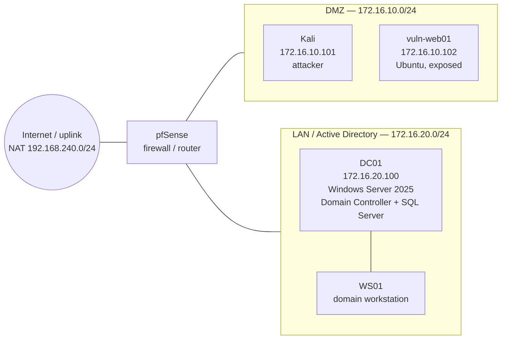

# Network topology

Three segments separated by pfSense. The attacker (Kali) is attached only to the DMZ; the internal LAN is reachable only by pivoting through a compromised DMZ host. LAN→DMZ traffic is blocked.

