# RedForge — Technical Report

*Penetration test of a self-built Active Directory lab · redforge.local*

---

## Executive summary

An attacker starting with zero credentials, with access only to the DMZ, obtained full control of the `redforge.local` Active Directory domain in a single attack chain. The entry point was not Active Directory itself: it was a SQL Server instance with a weak administrative password, which opened the way to command execution, privilege escalation, and finally the extraction of all domain credentials.

The result is a **total domain compromise**: NTLM hashes for every account in the domain were extracted, including the Administrator and the `krbtgt` account. Possession of the `krbtgt` key allows the forgery of Golden Tickets; remediation does not follow from a normal password change but requires a double reset of the `krbtgt` password, and any tickets already forged remain valid until they expire. The practical impact is complete and persistent control of the domain, its accounts, and connected services.

The root cause is not a single exotic vulnerability but a combination of common, realistic misconfigurations, the most serious of which is architectural: **an application (SQL Server) installed directly on the Domain Controller.** This made compromise of the application equivalent to compromise of the domain controller.

Seven findings were identified: **2 Critical, 2 High, 3 Medium.** Each is detailed below with impact and remediation.

---

## Objective and methodology

RedForge is an intentionally vulnerable Active Directory laboratory, designed and built to practise and document a full attack chain in an isolated environment. All offensive activity was confined to the lab's virtual machines.

**Objective:** starting from a foothold in the DMZ and with no pre-assigned domain credentials, demonstrate whether and how an attacker can reach full compromise of the internal domain.

**Binding rule (zero-to-credential):** no IP, username, port, or credential was assumed as known. Every piece of information was discovered during the attack through enumeration, cracking, or abuse of misconfigurations.

The methodology follows a standard kill chain, where each phase enables the next:

1. **Recon & enumeration** — host and service discovery
2. **Initial access** — access to the exposed DMZ target
3. **Local privilege escalation** — from user to root on the DMZ host
4. **Pivoting** — opening a channel into the internal network
5. **Exploitation** — access to the Domain Controller via SQL Server
6. **Domain privilege escalation** — from service account to SYSTEM on the DC
7. **AD enumeration** — mapping the attack paths (BloodHound)
8. **Credential access / domain compromise** — extraction of the domain database

The environment combines a pfSense firewall separating a DMZ (exposed web target) from an internal LAN (Active Directory), with the attacker machine (Kali) attached only to the DMZ, to force pivoting as in a real engagement.

---

## Network architecture

The network is split by pfSense into three segments. Segmentation is the central constraint of the exercise: the attacker machine sees only the DMZ, and the internal LAN is reachable only through a compromised DMZ host.

| Segment | Subnet | Host | Role |
|---------|--------|------|------|
| WAN | 192.168.240.0/24 | (dedicated NAT) | Lab uplink |
| DMZ | 172.16.10.0/24 | Kali 172.16.10.101 | Attacker |
| DMZ | 172.16.10.0/24 | vuln-web01 172.16.10.102 | Exposed target (Ubuntu) |
| LAN | 172.16.20.0/24 | DC01 172.16.20.100 | Domain Controller (Windows Server 2025) |
| LAN | 172.16.20.0/24 | WS01 | Domain-joined workstation |

Gateways: `172.16.10.254` (DMZ) and `172.16.20.254` (LAN), both on pfSense.

**Segmentation rules observed:**

- DMZ→LAN traffic is allowed in a controlled way (required for the target to function, and abused for the pivot).
- LAN→DMZ traffic is **blocked**: the Domain Controller cannot initiate connections toward the DMZ. This prevented the attacker from having the DC "pull" tools from Kali, forcing files to be pushed through the already-established channel.
- vuln-web01 has a **single interface** (DMZ): it is not dual-homed, so discovery of the LAN comes from an information leak rather than a second NIC.

Active Directory domain: `redforge.local`, forest/domain functional level Windows Server 2025.

---

## Attack narrative

The chain reads as one story: each step produces exactly what the next one needs.

### 1. Initial access — DMZ foothold
Enumeration of the exposed target vuln-web01 and SSH access with weak credentials found through brute force (`jdoe:password`).

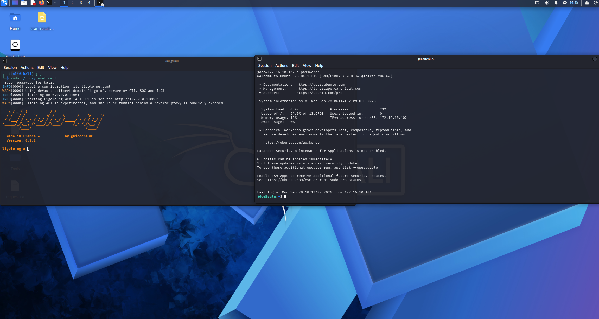

### 2. Local privilege escalation (Linux)
`sudo -l` reveals `(ALL) NOPASSWD: /usr/bin/find`. `find` is an abusable binary (GTFOBins): `sudo find . -exec /bin/bash \;` returns a root shell.

### 3. Internal network discovery (information disclosure)
vuln-web01 has a single interface, so the LAN is not visible via a second NIC. Discovery happens through DNS: `resolvectl status` reveals an internal name server never seen before, `172.16.20.100` — i.e. the existence of the `172.16.20.0/24` network and the `redforge.local` domain.

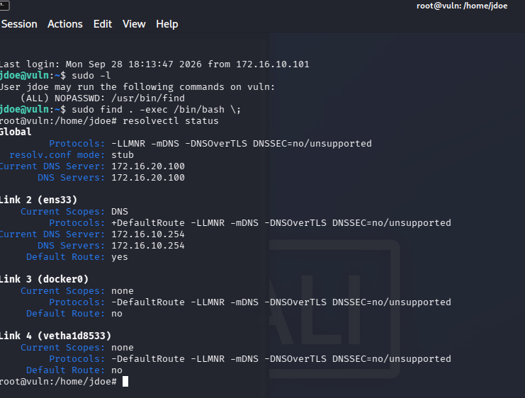

### 4. Pivoting
A tunnel is established with **ligolo-ng**: agent on vuln-web01, proxy on Kali, TUN interface and route `172.16.20.0/24 dev ligolo`. From here Kali reaches the LAN through the compromised DMZ host.

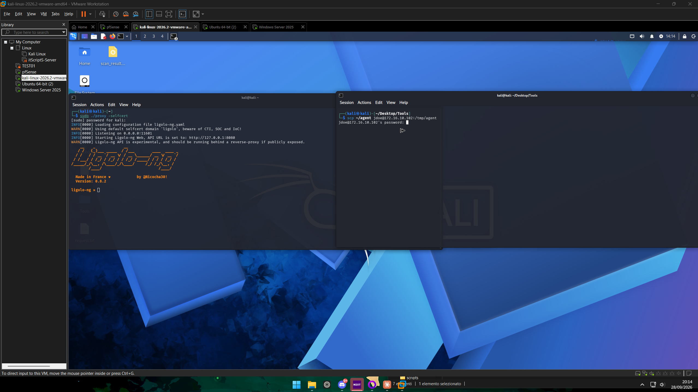

### 5. Target and vector discovery
Port scan through the tunnel: `DC01` (172.16.20.100) exposes the classic Active Directory services plus **SQL Server on 1433**. Service detection identifies Microsoft SQL Server 2025 and, via NTLM, the domain and hostname without authentication.

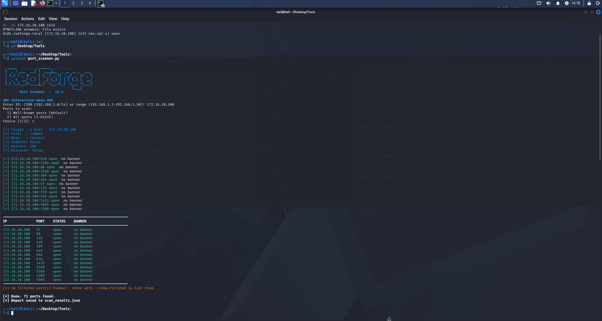

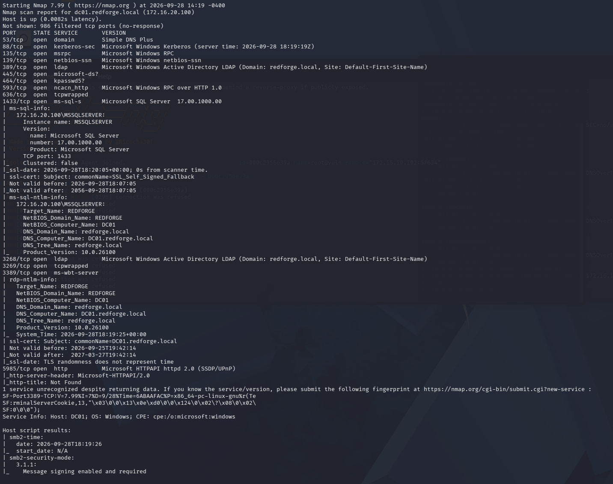

### 6. SQL Server access (default-credential attack)
A dictionary attack of default credentials against the `sa` login using a SecLists list:

```
hydra -C /usr/share/seclists/Passwords/Default-Credentials/mssql-betterdefaultpasslist.txt mssql://172.16.20.100
```

Result: `sa : #SAPassword!`. (Methodology note: the file is a `user:password` combo list, so it must be used with Hydra `-C`, not as a single password list.)

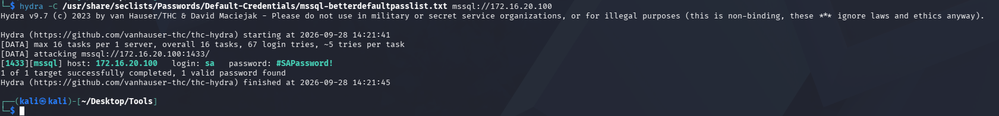

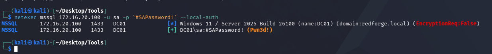

### 7. Remote code execution
Connection with `mssqlclient.py` and enabling of `xp_cmdshell`. `EXEC xp_cmdshell 'whoami'` returns `redforge\ssql`: commands run as the domain account the SQL service runs under.

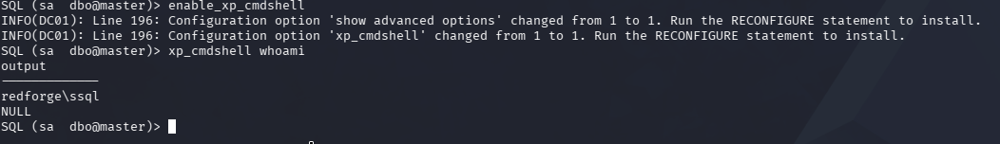

### 8. Domain privilege escalation (to SYSTEM)
`whoami /priv` shows **SeImpersonatePrivilege enabled**, typical of service accounts. Abused with **GodPotato** (DCOM/OXID) to impersonate the SYSTEM token: `whoami` returns `nt authority\system` on the Domain Controller. PrintSpoofer, tried first, times out on Server 2025; GodPotato works.

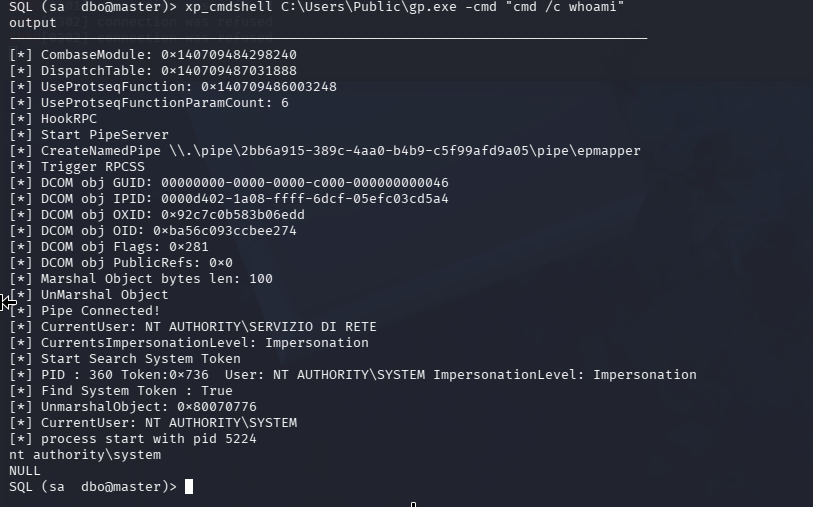

### 9. AD enumeration (BloodHound)
Data collected with SharpHound run directly on the DC (local LDAP). The graph shows the path `SSQL -[SQLAdmin]-> DC01 -[HasSession]-> Administrator -[MemberOf]-> Domain Admins`. SYSTEM access on the DC, already obtained in phase 8, is in itself the compromise: BloodHound here documents the privileged relationships that make control of the DC equivalent to control of the domain's privileged accounts and assets — it is not the step that first proves the compromise.


### 10. Domain compromise
With SYSTEM on the DC, extraction of the Active Directory database via `ntdsutil` — a native Windows component that creates a copy of the database through a Volume Shadow Copy (VSS) snapshot. In the defensive configuration present during the test, this operation was not blocked by the antivirus (unlike an LSASS dump, which the ASR rule blocks):

```
ntdsutil "activate instance ntds" "ifm" "create full C:\Users\Public\ntds_dump" quit quit
```

`ntds.dit` and the SYSTEM hive were exfiltrated, then parsed offline:

```
secretsdump.py -ntds ntds.dit -system SYSTEM.hive LOCAL
```

This yielded the NTLM hashes of all accounts in the NTDS database, including Administrator and `krbtgt`.

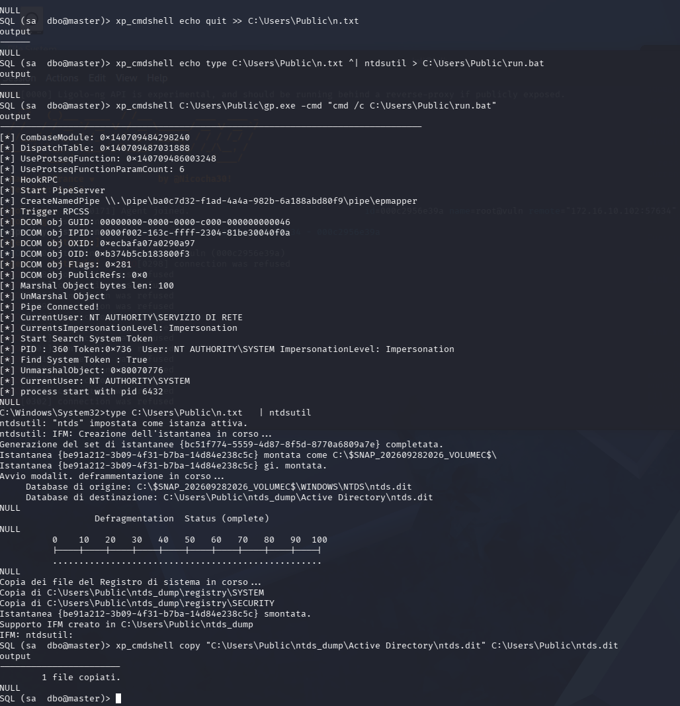

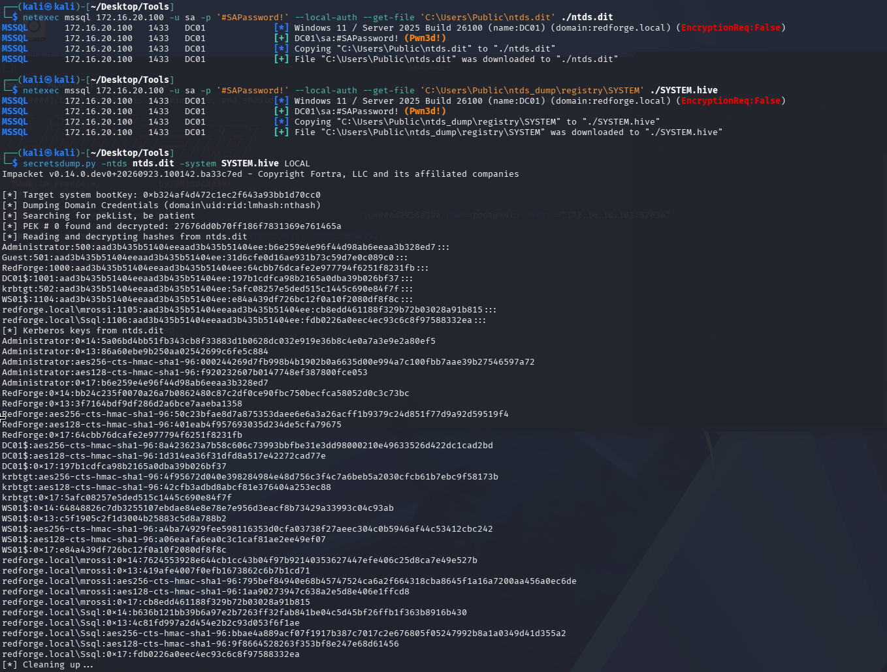

### 11. Compromise verification (Pass-the-Hash)
The Administrator hash is used without knowing the password: `netexec smb 172.16.20.100 -u Administrator -H <hash>` returns `Pwn3d!`, and `evil-winrm` opens an interactive shell as `redforge\administrator`. Complete, interactive control of the domain.

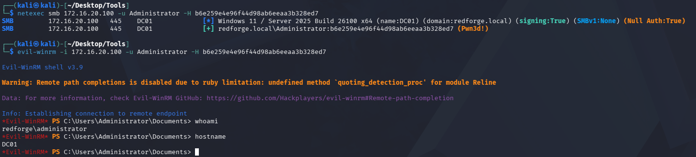

---

## Findings and recommendations

| # | Finding | Severity |
|---|---------|----------|
| F1 | SQL Server installed on the Domain Controller | Critical |
| F2 | Weak `sa` login (Mixed Mode) exposed on the network | Critical |
| F3 | `xp_cmdshell` enabled + SQL service as a domain account | High |
| F4 | `SeImpersonatePrivilege` on the service account | High |
| F5 | Weak service-account passwords with Kerberoastable SPNs | Medium |
| F6 | Weak credentials on an exposed SSH service (DMZ) | Medium |
| F7 | Internal DNS exposed to a DMZ host | Medium |

### F1 — SQL Server on the Domain Controller (Critical)
**Description.** The SQL Server instance runs on the same host that is the Domain Controller. **Impact.** Compromise of the application coincides with compromise of the DC: there is no boundary between "I breach the app" and "I control the domain." This is the cause that turns a weak password into a domain compromise. **Remediation.** Never host applications on Domain Controllers. Move SQL Server to a dedicated member server; DCs should run only AD roles.

### F2 — Weak, exposed `sa` login (Critical)
**Description.** Mixed Mode authentication enabled, `sa` login active with a password present in public lists (`#SAPassword!`), port 1433 reachable. **Impact.** Initial entry point to the DC with no domain credentials. **Remediation.** Disable the `sa` account; prefer integrated Windows authentication; if SQL authentication is required, use long random passwords; restrict network access to 1433 to the necessary sources only.

### F3 — `xp_cmdshell` + domain service account (High)
**Description.** `xp_cmdshell` is enabled and the SQL service runs as a domain account (`REDFORGE\ssql`), so commands obtain a domain context. **Impact.** From `sa` access to command execution as a domain principal on the DC. **Remediation.** Keep `xp_cmdshell` disabled; run the SQL service under a least-privilege account or a gMSA, never an account with broad domain rights.

### F4 — SeImpersonatePrivilege → SYSTEM (High)
**Description.** The service account holds `SeImpersonatePrivilege`. This is not a vulnerability in the strict sense but a privilege assignment which, combined with running the SQL service on the Domain Controller, enables escalation to SYSTEM via "Potato" techniques. **Impact.** Local escalation from service account to SYSTEM on the Domain Controller. **Remediation.** Minimise service-account privileges; do not grant `SeImpersonatePrivilege` where not strictly necessary; keep the system patched. Removing F1 (SQL off the DC) means this escalation would no longer affect a domain controller.

### F5 — Kerberoastable service accounts with weak passwords (Medium)
**Description.** Accounts with SPNs (`mrossi`, `ssql`) and weak passwords, obtainable via Kerberoasting and offline cracking. **Impact.** Any authenticated domain user can obtain service-account credentials. **Remediation.** Long random passwords (25+ characters) or gMSA for accounts with SPNs; monitor anomalous service-ticket requests. **Scope note.** This finding was identified during the assessment but is not part of the documented compromise path: access to `ssql` was obtained through SQL Server, not through Kerberoasting. It is an additional, independent weakness.

### F6 — Weak credentials on exposed SSH (Medium)
**Description.** The DMZ host accepts password authentication with weak credentials (`jdoe:password`), discoverable through brute force. **Impact.** Initial foothold in the DMZ. **Remediation.** Disable SSH password authentication (keys only); strong passwords; rate limiting / fail2ban.

### F7 — Internal DNS exposed to a DMZ host (Medium)
**Description.** vuln-web01 (DMZ) is configured to use the internal Domain Controller as its DNS; `resolvectl` reveals the LAN IP (172.16.20.100) and the domain name. **Impact.** Facilitates the internal-network discovery phase by giving the attacker the existence of the LAN segment and the domain. This finding does not enable the pivot itself — the pivot is made possible by the compromise of vuln-web01 and the firewall rule allowing DMZ→LAN traffic — but it accelerates discovery. **Remediation.** DMZ hosts should not use the internal domain DNS; use a dedicated resolver for the DMZ and segment name resolution.

---

## Defensive observations

Not everything was vulnerable: several defenses worked and raised the bar. An honest report documents them, because they indicate where the posture was correct and should be maintained.

- **LDAP and SMB signing enforced.** The Domain Controller enforces signing. This blocked data collection with the Python collector through the tunnel (unsigned LDAP bind rejected) and hinders NTLM relay attacks to SMB. This is a correct configuration to keep.
- **Anonymous enumeration blocked.** Null SAMR and anonymous LDAP are both refused by the DC: no user enumeration without authentication.
- **SYSVOL not anonymously readable.** The attempt to read SYSVOL without authentication was denied, confirming that GPP techniques still require already-authenticated domain access.
- **Antivirus effective against known tools.** Windows Defender detected and blocked known offensive tools (GodPotato, PrintSpoofer, SharpHound) on write to disk, and an ASR rule blocked the LSASS dump attempt. In a real environment with Defender active, these steps would have required dedicated evasion techniques.

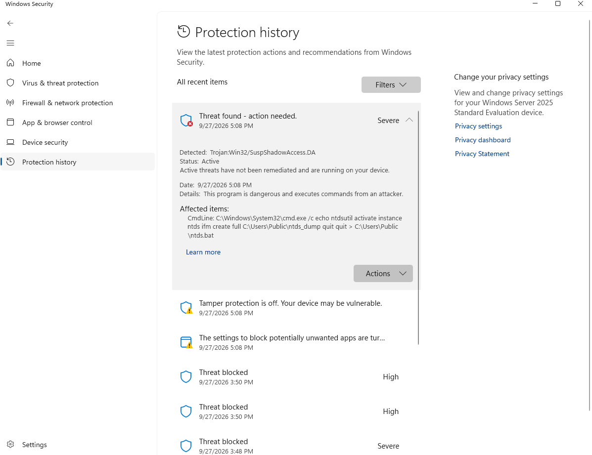

**Note on the lab environment.** To complete the educational exercise, an antivirus exclusion was added on one DC folder and Tamper Protection was disabled. In an engagement or in production these accommodations would not exist: AV/EDR and ASR rules would have forced significant evasion work to proceed past phase 8. This should be kept in mind when judging the realism of the chain: initial access (F1–F3) remains fully exploitable, while escalation with known tools would have been noisier.

---

## Conclusions

The domain was fully compromised starting from zero credentials, and none of the steps required a rare vulnerability or a sophisticated exploit. The chain is made of ordinary misconfigurations, linked together. That is the point: the sum of "minor" errors produces a maximum-impact result.

Remediation, in order of impact:

1. **Remove SQL Server from the Domain Controller (F1).** This is the single action that interrupts the documented compromise path: without an application on the DC, breaching the application no longer equals owning the domain. Top priority.
2. **Close the SQL vector (F2, F3).** Disable `sa`, use Windows authentication, turn `xp_cmdshell` off, run the service under a least-privilege account (gMSA).
3. **Harden the accounts (F4, F5).** Least privilege on service accounts, long/random passwords or gMSA for SPNs.
4. **Fix the DMZ perimeter (F6, F7).** SSH keys only, and no use of internal DNS from exposed hosts.

If only one fix could be applied, the priority would be F1: on its own it interrupts the documented path and prevents compromise of the SQL service from translating into compromise of the Domain Controller. It should be noted that this does not by itself guarantee an attacker would remain confined to the member server: the other weaknesses (F2–F7) still need to be corrected.

On the defensive side, the posture was not entirely lacking: enforced signing, blocked anonymous enumeration, and an antivirus that actually stopped known tools are all correct elements to preserve and build on (ideally with an EDR and monitoring of credential-access and Kerberoasting techniques).

---

## Appendix

### Tools used

| Tool | Phase | Use |
|------|-------|-----|
| Hydra | Initial Access, SQL | SSH brute force and MSSQL combo spray (`-C`) |
| ligolo-ng | Pivoting | DMZ→LAN tunnel |
| netexec | Various | Auth checks, `--put-file`/`--get-file` over MSSQL, PtH over SMB |
| Impacket (mssqlclient, secretsdump) | Exploitation, Domain Compromise | SQL shell, offline NTDS dump |
| GodPotato | Privilege Escalation | SeImpersonate abuse to SYSTEM |
| SharpHound + BloodHound-CE | AD Enumeration | Collection and attack-path analysis |
| ntdsutil | Domain Compromise | AD database extraction via VSS (LOLBin) |
| evil-winrm | Verification | Interactive shell via Pass-the-Hash |

### Custom scripts

- **`port_scanner.py`** — threaded port scanner with host discovery, used for recon and target discovery through the tunnel.
- **`parse_kerb.py`** — parses a raw Kerberos ticket into hashcat format, written for the Kerberoasting phase.
- **`report_generator.py`** — reporting helper.
